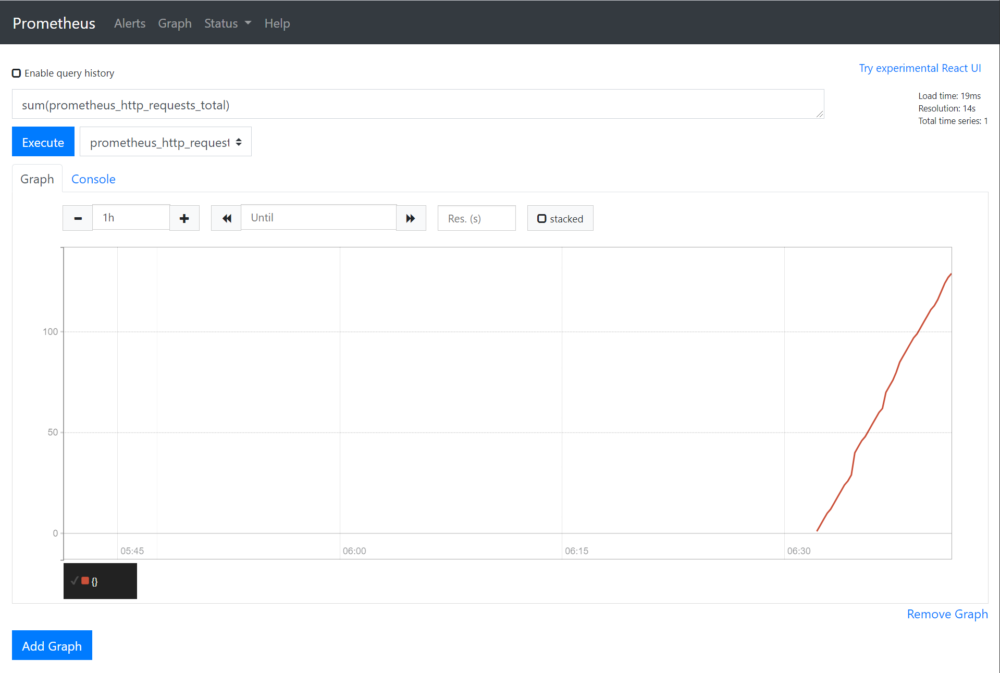

<div class="download">
</div>

<h1>Prometheus</h1>

Prometheus is the de-facto standard for monitoring in the cloud age. In a classic monitoring scenario the monitoring system has a fixed set of IP addresses. As the cloud is dynamic in its nature a fixed list of IP addresses is not sufficient.

Prometheus brings with it a *modular* approach. It employs *service discovery* to find the IP addresses and ports of the services it is supposed to gather information from. It then connects these services (e.g. a metrics server on each of your web servers) and collects any metrics they expose. These metrics are gathered in a *time-series database* and can be queried with a specialized query language called [PromQL](https://prometheus.io/docs/prometheus/latest/querying/basics/).

## Running Prometheus

The easiest way to run Prometheus is using a container. As a first step you need to create a configuration file. Let's say, you are putting this in `/srv/prometheus.yml`:

```yaml
global:
  scrape_interval: 15s
scrape_configs:
  - job_name: 'prometheus'
    scrape_interval: 5s
    static_configs:
      - targets: ['localhost:9090']
``` 

This configuration file will tell Prometheus to gather its own metrics. Having this configuration file, we can launch Prometheus:

```bash
docker run \
    -d \
    -p 9090:9090 \
    -v /srv/prometheus.yml:/etc/prometheus/prometheus.yml \
    prom/prometheus
```
    
!!! warning
    This will run Prometheus on your host machine on port 9090. Prometheus itself does not have any authentication. Make sure to secure your server with security groups as needed.

After running the previous command you can now enter the IP address of your server into your browser and access Prometheus on port 9000. The interface looks like this:


## Querying Prometheus

Prometheus is running and gathering its own metrics. You can check the successful metrics scraping by navigating to Status &rarr; Targets. You can also visualize the gathered metrics from the Graph interface by clicking the `- insert metric at cursor -` dropdown. For example, you can add the `prometheus_http_requests_total` metric to show the HTTP requests Prometheus has received on each endpoint:


You can also summarize the HTTP requests by using the `sum(prometheus_http_requests_total)` formula:



As you can see, this graph is ever-growing. This is because the graph type is a `counter`. Counters always increase. Let's get the requests per minute by applying the `rate()` function: `sum(rate(prometheus_http_requests_total[1m]))`


You can read more about the available query functions in PromQL [in the official documentation](https://prometheus.io/docs/prometheus/latest/querying/functions/).

## Configuring a node exporter

Prometheus in and of itself does not do anything. It needs to read from an exporter. The easiest and probably most useful exporter to start with is the [node exporter](https://github.com/prometheus/node_exporter). The node exporter exposes the basic metrics of a machine, such as CPU and memory usage.

Let's start by launching the node exporter on the same host as Prometheus:

```bash
docker run -d \
  --net="host" \
  --pid="host" \
  -v "/:/host:ro,rslave" \
  quay.io/prometheus/node-exporter \
  --path.rootfs=/host
```

In the next step you can configure the *public IP* of your Prometheus server to be scraped for metrics in your `prometheus.yml`:

```yaml
global:
  scrape_interval: 15s
scrape_configs:
  - job_name: 'prometheus'
    scrape_interval: 5s
    static_configs:
      - targets: ['localhost:9090']
  - job_name: Monitoring Server Node Exporter
    static_configs:
      - targets:
          - '1.2.3.4:9100'
```

!!! note
    The `localhost:9090` and the `1.2.3.4:9100` are *not* the same! Remember, Prometheus runs in a container and has its own network stack. The node exporter on the other hand is running with `--net="host"` so it shares the network stack of the host operating system. 

Let's restart Prometheus and then check Status &rarr; Targets to see if the node exporter shows up as a target. We can also look at the CPU metrics of our monitoring host: `node_cpu_seconds_total`


As you can see, the CPU query results in several counters. This is the result of how CPU metrics gathering works. These separate metrics (`user`, `system`, `steal`, `softirq`, `nice`, `irq`, `iowait`, and `idle`) always add up to 100%. Let's query the CPU usage we actually care about: the CPU time used by our applications and our kernel. This can be done by filtering out the `idle` state and then comparing it to the whole:

```
sum(rate(node_cpu_seconds_total{mode!="idle"}[1m])) /
sum(rate(node_cpu_seconds_total[1m]))
```

## Dynamic scraping

There is a [wide range of service discovery options available](https://prometheus.io/docs/prometheus/latest/configuration/configuration/#configuration-file). In our case we will implement the [file SD](https://prometheus.io/docs/prometheus/latest/configuration/configuration/#file_sd_config). The file service discovery periodically checks a file for changes and reads the IP addresses in that file.

Let's extend our configuration my the file SD configuration:

```yaml
global:
  scrape_interval: 15s
scrape_configs:
  - job_name: 'prometheus'
    scrape_interval: 5s
    static_configs:
      - targets: ['localhost:9090']
  - job_name: Monitoring Server Node Exporter
    static_configs:
      - targets:
          - '1.2.3.4:9100'
  - job_name: Custom
    file_sd_configs:
      - files:
          - /custom_servers.json
        refresh_interval: 10s
```

To make this work you will have to mount an additional volume for Prometheus:

```bash
docker run \
    -d \
    -p 9090:9090 \
    -v /srv/custom_servers.json:/custom_servers.json \
    -v /srv/prometheus.yml:/etc/prometheus/prometheus.yml \
    prom/prometheus
```

Finally, let's place the following file in `/srv/custom_servers.json` on the host:

```json
[
  {
    "targets": [ "1.2.3.4:9100" ]
  }
]
```

You can enter the IP address of a second server in this file to enable scraping and restart Prometheus this one last time to enable loading this file. When you change this file in the future Prometheus will automatically pick up the changes. Prometheus will connect the second server and fetch the metrics from that server, which you should then be able to query.

Let's repeat the PromQL query from the example above to get the CPU usage. You will see that it won't give you two graphs. That's because it will *summarize* the CPU usage. Let's group it by the IP address:

```
sum by (instance) (rate(node_cpu_seconds_total{mode!="idle"}[1m])) /
sum by (instance) (rate(node_cpu_seconds_total[1m]))
```

The only thing left to do is to write an automatic cron job that fetches the IP address list from the cloud provider (Exoscale in our case) and populates this file automatically.

!!! tip
    Prometheus would be able to do the alerting behavior required for the [project work](/projectwork) itself without Grafana using the [Alert Manager](https://prometheus.io/docs/alerting/latest/alertmanager/). This is also a valid and accepted alternative, but for the ease of configuration we are going to demonstrate [Grafana in the next exercise](/exercises/5-grafana).

