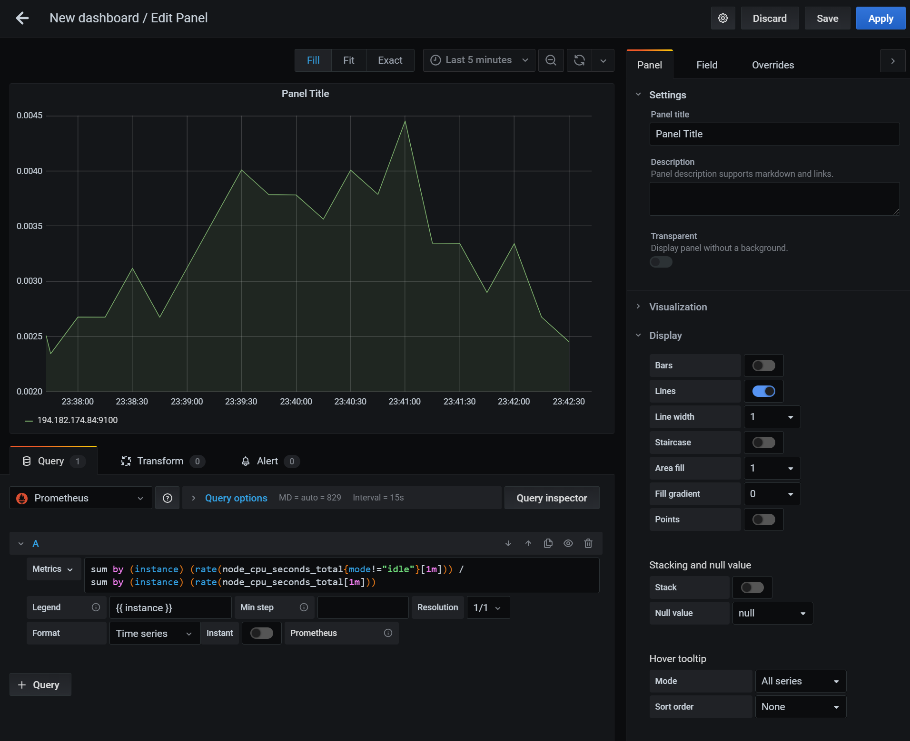

<div class="download">
</div>

<h1>Grafana</h1>

[Grafana](https://grafana.com/) is a common way to visualize information from multiple source systems, including [Prometheus](/exercises/4-prometheus). It offers a user friendly way to create graphs, alters, and display metrics.

## Running Grafana

Like Prometheus before, Grafana can be run in a container:

```
docker run -d \
  -p 3000:3000 \
  grafana/grafana
```

This will launch Grafana on port 3000 of your node.

## Setting up Grafana with Prometheus

Grafana is an aggregator for information from many different systems. Data sources can be configured in the Configuration &rarr; Data sources menu on the left side. When adding a Prometheus data source you simply have to provide Grafana with your Prometheus URL. If you did not deploy any additional changes in the previous exercise you can leave everything else on default settings.


## Creating a CPU graph

Once you have the data source set up you can create a new dashboard and add a panel. The panel can have different visualization types, but will always draw its data from a query in the bottom box. Make sure to select the Prometheus data source and you will be presented with an option to enter your PromQL query. In addition, you can also provide sophisticated legend information, such as `{{ instance }}` to list the instance name.



On the right hand side you can adjust various display options, for example what range and display format the Axis' should have in the graph.

## Creating an alert

In the same interface as above you can create an alert. The alert will allow you to set an evaluation period to determine how often the rule is evaluated. You can also set the `For` field to allow a grace period before the alert triggers. The conditions give you a way to create a flexible set of rules when an alert should be triggered.


You can also set up notifications to send the alert to various notification channels. This functionality can be used to trigger the scaling behavior required in the project work.

## Setting up a notification channel

Before you can set up an alert notification you have to create a notification channel. This can be done from the left hand menu by going to Alerting &rarr; Notification channels. For the purposes of the project work the notification type should be "webhook". The URL should point to your custom web server that triggers Exoscale to increase the instance pool size. Finally, you should also set up the "Send reminders" option to keep triggering the scale up/down behavior if the CPU usage is still high/low.


## Deploying Grafana in an automated fashion

Since our project work revolves around Terraform we need a way to deploy Grafana with all settings in an automated fashion. Thankfully, the Grafana developers have thought of this and [provided us with a way to do that](https://grafana.com/docs/grafana/latest/administration/provisioning/).

### Provisioning data sources

To provision data sources we must place or mount the data source configuration file in the `/etc/grafana/provisioning/datasources/` directory inside the Grafana container in YAML format. For Prometheus this data source could look like this:

```yaml
apiVersion: 1
datasources:
- name: Prometheus
  type: prometheus
  access: proxy
  orgId: 1
  url: http://prometheus:9090
  version: 1
  editable: false
```

### Provisioning a notification channel

Notification channels can also be provisioned by placing the appropriate YAML file in `/etc/grafana/provisioning/notifiers/`:

```yaml
notifiers:
  - name: Scale up
    type: webhook
    uid: scale-up
    org_id: 1
    is_default: false
    send_reminder: true
    disable_resolve_message: true
    frequency: "2m"
    settings:
      autoResolve: true
      httpMethod: "POST"
      severity: "critical"
      uploadImage: false
      url: "http://autoscaler:8090/up"
```

Note, that the `uid` field of the notifier matters as this will be referenced from the dashboard.

### Provisioning dashboards

Provisioning dashboards is slightly more complex. As a first step we must tell Grafana to look in a certain directory for the dashboard configuration file. Grafana will periodically check this directory. This can be done from a YAML file in the `/etc/grafana/provisioning/dashboards/` directory:

```yaml
apiVersion: 1

providers:
- name: 'Home'
  orgId: 1
  folder: ''
  type: file
  updateIntervalSeconds: 10
  options:
    path: /etc/grafana/dashboards
```

We can then place the dashboard JSON file in the specified directory. The easiest way to create a JSON file is to manually create it in Grafana and then copy the JSON from the Grafana dashboard. Keep in mind that you may have to adjust the JSON manually to match your notification channel `uid` values.