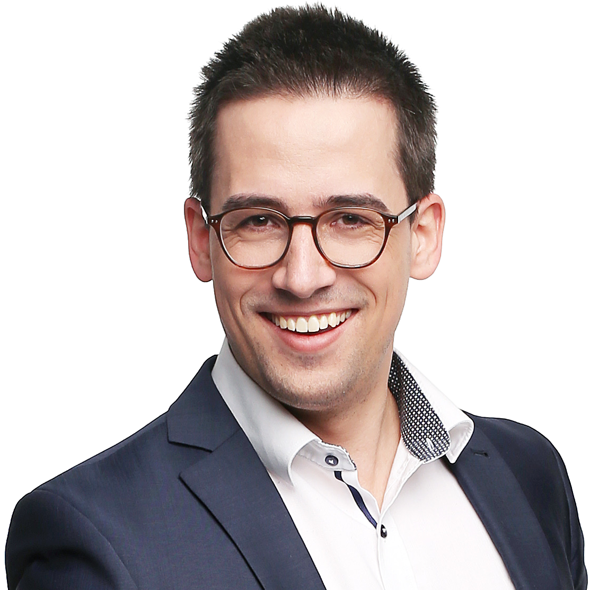

Welcome to the Cloud Computing course of September 2020! On this page you will find all learning
materials you need to learn in order to pass the course.

## About the Course

- Cloud Computing
- Learning approach: Remote learning
    - Educational materials in writing.
    - Videos and slide decks are available for the lecture part
    - Videos of all demos are available.
    - Source code is available on GitHub for all demos.
    - Homework preparation tasks / learning diary, project work.
    - Online consultation for participants once a week.
- 4 ECTS, roughly 112 hours of study (5-7 hours of study per week recommended)
- Lectures are on the [lectures page](/lectures/index.md).
- Grading is described on the [grading page](/grading/index.md).
- Deadlines are described on the [deadlines page](/deadlines/index.md).
- Testing is described on the [testing page](/testing/index.md).
- Find help on the [getting help page](/help/index.md).

## About us

### Peter Wenzl

<aside>

</aside>

E-mail: [peter.wenzl@edu.fh-campuswien.ac.at](mailto:peter.wenzl@edu.fh-campuswien.ac.at)

- Computer Science Master (Dipl. Ing.), TU Wien, 2000
- Telecoms Focused Career
- Ericsson Austria
- mobilkom Austria
- Oracle Austria GmBH (CGBU)
- Frequentis AG

### Janos Pasztor

<aside>

</aside>

E-mail: [janos.pasztor@edu.fh-campuswien.ac.at](mailto:janos.pasztor@edu.fh-campuswien.ac.at)  
Linkedin: [www.linkedin.com/in/janoszen/](https://www.linkedin.com/in/janoszen/)  
Website: [pasztor.at](https://pasztor.at)

- Software developer and DevOps engineer background (10+ years experience)
- Web Focused Career
- Currently works as a Developer Advocate at A1 Telekom / A1 Digital / Exoscale
