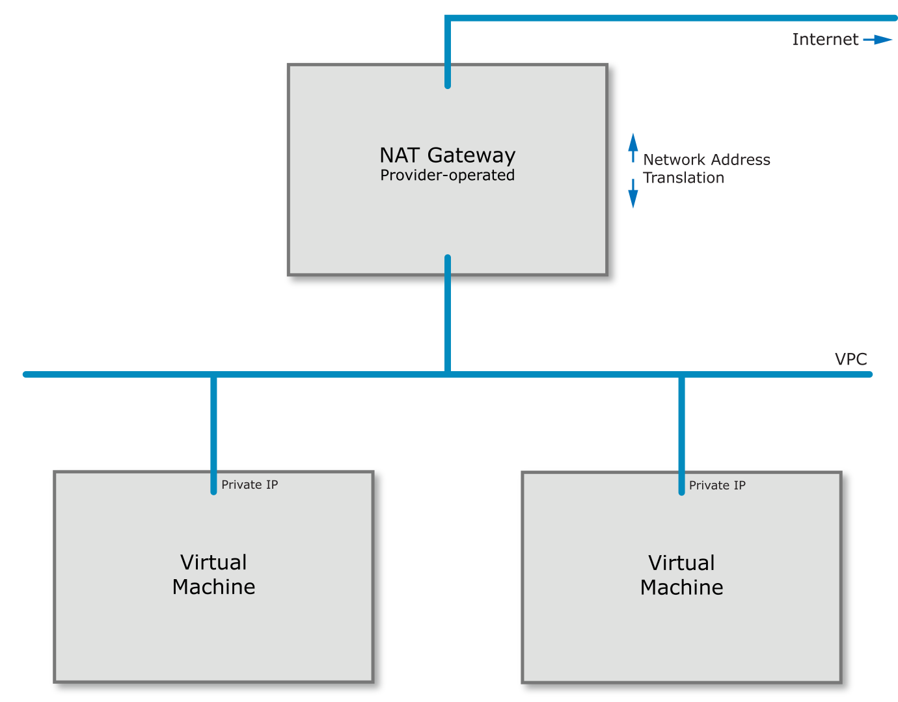
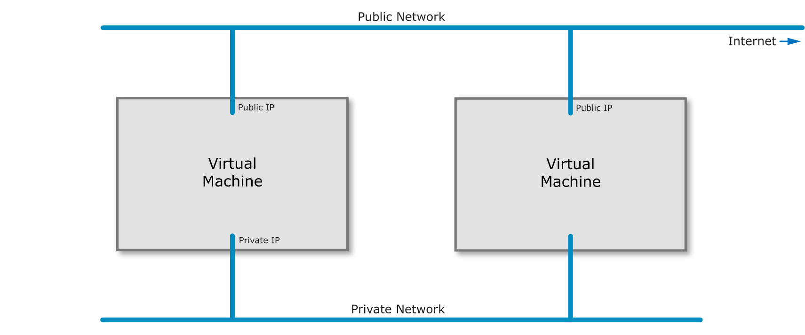
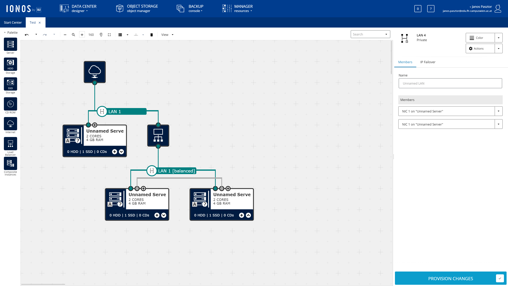
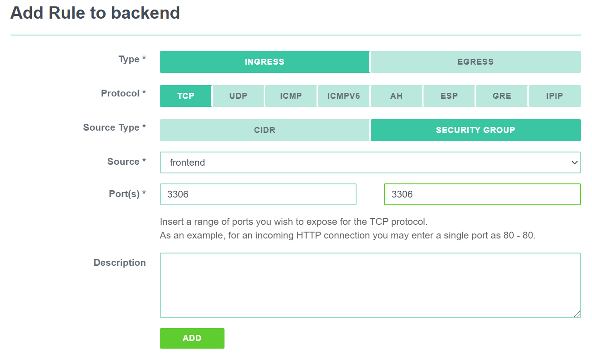
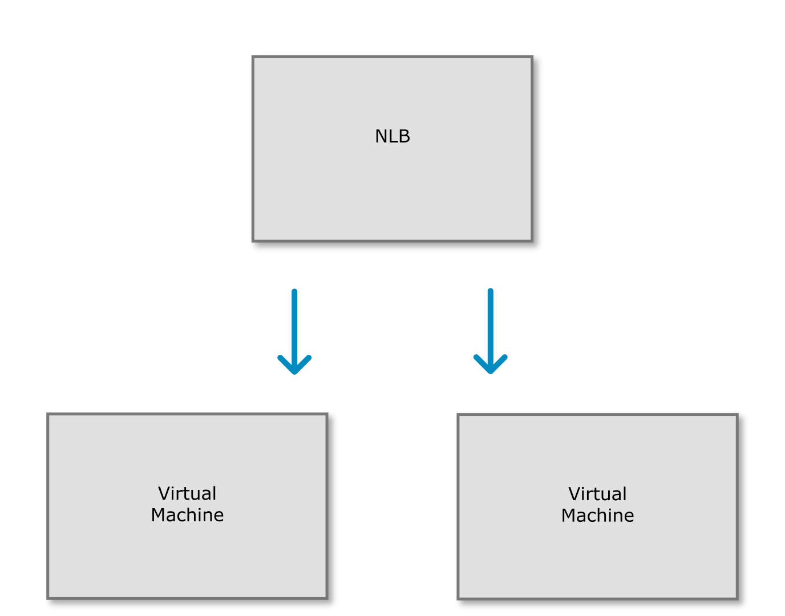

<a href="fh-cloud-computing-lecture-2-iaas.pptx"><button>Download PPTX 💻</button></a>
<a href="fh-cloud-computing-lecture-2-iaas.mp3"><button>Download MP3 🎧</button></a>
<a href="fh-cloud-computing-lecture-2-iaas.m4b"><button>Download M4B 🎧</button></a>
<a href="#"><button>Watch Video 🎬</button></a>

<h1>Infrastructure as a Service</h1>

Infrastructure as a Service, or IaaS is a service offering by most cloud providers that provides *virtual machines*
and the accompanying infrastructure as a service. This lecture will discuss the details of how an IaaS service is
built.

## Virtual machines

!!! tldr "In a hurry?"
    Modern CPUs have several operation modes:
    
    - Ring 3 (unprivileged) runs the application
    - Ring 0 runs the operating system kernel
    - Ring -1 runs the hypervisor managing serveral kernels
    - Ring -2 runs the Intel Management Engine
    
    Other components are responsible for virtualizing other hardware components. For example, the IOMMU is responsible
    for virtualizing direct memory access between applications and hardware components.
    

Virtualization is a surprisingly old technology. The first virtualized system was the IBM System/370 mainframe with the
VM/370 operating system in 1972. The system was different from how we understand virtualization today, but the goal was
the same: separate workloads from each other.

When you think about mainframes you have to consider that these machines were *very* expensive and machine time was 
a scarce resource. Most programs back in those days were *batch jobs*. They processed a large set of data at once and
then terminated.

Initially CPUs in personal computers did not have application separation. The x86 line of Intel CPUs only received 
the *protected mode* feature with the 80286 in 1982. The operating system (MS/DOS) would run in in *real mode* and 
applications could then switch into the new mode to isolate applications from each other. One such application making
use of the new mode was Windows that ran on top of MS/DOS.

Protected mode introduced the concept of *rings* in the CPU. The operating system *kernel* would run in ring 0,
device drivers would run in ring 1 and 2 while applications would run in ring 3. The lower ring number meant the higher
privilege level.

!!! note
    Device drivers today typically run on ring 0 instead of 1 or 2.

This ring system allowed the operating system to restrict the higher ring numbers from accessing certain functions or
memory locations. However, most applications in the day would violate the restrictions of protected mode and could not
run in the new mode.

!!! note
    If you try and set up a really old computer game like [Commander Keen](https://en.wikipedia.org/wiki/Commander_Keen)
    in [DOSBox](https://www.dosbox.com/) you will realize that you have to provide the game itself with very
    hardware-specific settings. You will, for example, have to provide details for your sound card. This is because the
    game itself incorporated sound card drivers for Sound Blaster 16 or Gravis Ultrasound cards. A game that would do
    this could not run in protected mode.

To work around the problems with protected mode the 80386 successor introduced
[virtual mode](https://en.wikipedia.org/wiki/Virtual_8086_mode). The new virtual 8086 mode (VM86) introduced a number of
compatibility fixes to enable running old real mode programs in a multitasking environment such as Windows without
problems.

For instance the CPU would create a simulated *virtual* memory space the program could write to and translate the
virtual addresses to physical addresses internally. It would also capture sensitive instructions and turn them over for
control to the kernel.

!!! note
    VM86 does not capture *every* instruction the application runs in virtual mode, only the sensitive CPU instructions.
    This enables legacy applications to run at a reasonable speed.

In the mid 2000's CPUs became so powerful that it made sense to not only virtualize applications but whole operating
systems including their kernel. This allowed multiple operating systems to run in parallel. However, without CPU support
only *software virtualization* could be achieved. In other words early virtualization software had to *simulate* a CPU
in ring 0 to the guest operating system. Some virtualization techniques, such as [Xen](https://xenproject.org/) required
the guest operating system to run a modified kernel to facilitate them running in ring 3. Others employed
[a number of techniques](https://en.wikipedia.org/wiki/X86_virtualization#Software-based_virtualization) we won't go
into here.

Hardware vendors, of course, followed suit. In 2005 Intel added the VT-x (Vanderpool) feature to its new
Pentium 4 CPUs followed by AMDs SVM/AMD-V technology in 2006 in the Athlon 64, Athlon 64 X2, and Athlon 64 FX
processors.

VT-x and AMD-V added new ring -1 to accommodate *hypervisors*. This new ring allowed for separation between
several operating systems running at ring 0. Later CPU releases added features such as
[Direct Input/Output virtualization](https://software.intel.com/content/www/us/en/develop/articles/intel-virtualization-technology-for-directed-io-vt-d-enhancing-intel-platforms-for-efficient-virtualization-of-io-devices.html),
network virtualization or even graphics card virtualization. These features allowed for more efficient
virtualization and sharing hardware devices between several virtual machines.

!!! note
    Intel also introduced a ring -2 for the
    [Intel Management Engine](https://en.wikipedia.org/wiki/Intel_Management_Engine), a chip that functions as an OOBM
    in modern Intel chips. The ME runs its own operating system, a [MINIX](https://en.wikipedia.org/wiki/MINIX) variant
    and has been the target of severe criticism for its secrecy and power over the machine. Several bugs have been found
    in the ME that let an attacker hide a [malware inside the ME](https://youtu.be/3CQUNd3oKBM).

Virtualization also gave rise to Infrastructure as a Service. [AWS](https://aws.amazon.com/) was the first service
that offered virtual machines as a service starting in 2006 with a Xen-based offer. They not only offered virtual
machines but they did so that a customer could order or cancel the service using an
[Application Programming Interface](https://en.wikipedia.org/wiki/Application_programming_interface).

This allowed customers to create virtual machines as they needed it and they were billed for it on an hourly basis.
(Later on AWS and other cloud providers moved to a per-second billing.)

The presence of an API makes the difference between IaaS and plain old virtual machines as a service. IaaS allows
a customer to scale their application dynamically according to their current demand.

{{ quiz("What component of the software stack runs on Ring 3 in virtual mode?", [
    answer("The application"),
    answer("The kernel"),
    answer("The hypervisor"),
    answer("The management engine"),
]) }}

{{ quiz("What component of the software stack runs on Ring 0 in virtual mode?", [
    answer("The application"),
    answer("The kernel"),
    answer("The hypervisor"),
    answer("The management engine"),
]) }}

{{ quiz("What component of the software stack runs on Ring -1 in virtual mode?", [
    answer("The application"),
    answer("The kernel"),
    answer("The hypervisor"),
    answer("The management engine"),
]) }}

{{ quiz("What component of the software stack runs on Ring -2 in virtual mode?", [
    answer("The application"),
    answer("The kernel"),
    answer("The hypervisor"),
    answer("The management engine"),
]) }}

{{ quiz("What does virtualization mean?", [
    answer("Every instruction by a virtual machine is captured by the kernel and translated."),
    answer("Critical instructions like memory operations are captured or translated by the kernel."),
    answer("Critical instructions like memory operations are captured or translated by the CPU and the hypervisor."),
]) }}

## Typical instance types

When the cloud became popular in the late 2000s several providers attempted to offer a service that was fully dynamic
in their sizes. The customer could set how many GB of RAM they needed and how many CPU cores. However, this model has
been phased out by most providers since it is difficult to manage such a dynamic environment.

Instead most cloud providers nowadays opt to offer fixed machine sizes. To accommodate high-CPU
and high RAM workloads there are several different instance types, typically:

- **Shared CPU:** These are small instances where a single CPU core is shared between multiple virtual
  machines, sometimes leading to high [steal time](https://opensource.com/article/20/1/cpu-steal-time). Sometimes
  this offering includes a *burst* capability (such as the Amazon T instances) where a VM can temporarily use more
  CPU.
- **Standard, dedicated core CPU:** These instance types receive one or more physical cores leading to a more stable
  performance without the ability to burst beyond their limits.
- **High CPU:** These instance types are usually hosted on physical servers that have a very high CPU to RAM ratio.
  Accordingly, the virtual machine offering includes more CPU than the standard offering.
- **High RAM:** This offering is the exact opposite of the high CPU offering. The machines on offer here include more
  RAM with very little CPU.
- **Storage:** These instance types contain large amounts of local storage (see below in the storage section).
- **Hardware-specific:** These instance types offer access to dedicated hardware such as graphics cards (GPUs) or 
  FPGAs.

## Automation

!!! tldr "In a hurry?"
    - Cloud-init allows for running a script, or other initial configuration on virtual machines on first boot.
    - It is also responsible for managing password resets when desired. It can be used to fully automate the setup of a virtual
      machine.
    - Terraform and Ansible are tools that interact with the cloud API to provision virtual machines programmatically.
    - Ansible is also capable of running inside a virtual machine to configure the software within.
    - Terraform requires full control of the machines it is managing and implements what's called immutable infrastructure.
    

As discussed before, that makes an IaaS cloud provider a cloud provider is the fact that they offer an API to automate
the provisioning and deprovisioning of virtual machines as needed. However, that's not all. Simply starting a virtual
machine is not enough, the software needs to be installed in it.

Initially this problem would be solved by creating *templates* for the operating system that launches. In larger cloud
setups these templates included a pre-installed agent for configuration management that would report to a central
service and fetch its manifest of software to install.

Thankfully in the last decade a lot has happened and [Cloud Init](https://cloudinit.readthedocs.io/en/latest/) has
established itself as a defacto standard in the IaaS world. Every cloud provider nowadays offers the ability to submit
a *user data* field when creating a virtual machine. This user data file is read by Cloud Init (or its Windows
alternative [Cloudbase Init](https://cloudbase.it/cloudbase-init/)) and is executed at the first start of the virtual
machine.

A DevOps engineer can simply inject a script that runs at the first start that takes care of all the installation 
steps required.

Tools like [Terraform](https://terraform.io/) or [Ansible](https://www.ansible.com/) assist with managing the whole 
process of provisioning the virtual machines and supplying it with the correct user data script. 

{{ quiz("What is the role of cloud-init?", [
    answer("It initializes a cloud account."),
    answer("It creates a virtual machine."),
    answer("It runs initial machine configuration on a virtual machine."),
]) }}

## Virtual machine pools

!!! tldr "In a hurry?"
    - Virtual machine pools automatically create and destroy machines to keep up a desired pool size.
    - Some implementations also have autoscaling.

One other use of user data are virtual machine pools. Each cloud provider adopts a different name for them, ranging from
instance pools to autoscaling groups. The concept is the same everywhere: you supply the cloud with a configuration
how you would like your virtual machines to look like and the cloud will take care that the given number of machines
are always running. If a machine crashes or fails a health check the cloud deletes the machine and creates a new one.

The number of machines in a pool can, of course, be changed either manually or in some cases automatically using 
rules for automatic scaling.

Combined with the aforementioned user data this can be a very powerful tool to create a dynamically sized pool of
machines and is the prime choice for creating a scalable architecture.

These pools are often integrated with the various load-balancer offerings cloud providers have in their portfolio to
direct traffic to the dynamic number of instances. Some cloud providers integrate them with their Functions as a Service
offering as well allowing you to run a custom function whenever a machine starts or stops. This can be used to, for
example, update your own service discovery database.

## Storage

!!! tldr "In a hurry?"
    - Local disks offer affordable performance at the cost of redundancy.
    - Network block storage offers resilience to machine failures, but costs more to ensure the same performance. Not all
      NBS implementations store data in a redundant fashion.
    - Network file systems offer access from multiple virtual machines in parallel at the cost of performance.
    - Object storage offers parallel access from multiple VMs and scalability at the cost of performance and consistency.
    - Object storages are typically integrated on the application level rather than the OS level.

When it comes to data storage virtual machines work exactly like your physical machine would: there is a physical disk
(or multiple) that store the files. The difference is that in the cloud your virtual machine may make use of a 
distributed storage architecture instead of using a local disk. In a distributed storage system the data isn't stored
on the machine that runs the virtual machine so a hardware failure on that machine will not cause a data loss.

However, a distributed storage system is generally either slower or more expensive for the same performance by several
magnitudes so using a local storage may still be needed for some use cases.

When we talk about storage systems we are talking about two types: block devices and filesystems. On they physical
disk data is stored in its raw form so the disk itself has no information about which data belongs to which file.
Filesystems organize data into *blocks* of a fixed or dynamic size and then create a database (mapping table) of 
which file entry consists of which blocks of data. Keep in mind that the blocks of a single file may be distributed
all over the whole disk randomly so that's something the filesystem must keep track of.

Therefore we traditionally call raw disk devices *block devices*. Block devices are (with very few exceptions) only
accessible from a single virtual or physical machine since otherwise the machines would have to synchronize their file
system operations on that device. The only notable exception is [GFS2](https://en.wikipedia.org/wiki/GFS2). While you
can use GFS2 over a shared storage infrastructure if you have control over it cloud providers enforce a single-VM access
policy. In other words, one block storage device can only ever be used by a single VM. 

### Local Storage

As described above the simplest and most widely supported option to store data from your virtual machine is a disk that
is locally attached to the physical machine running the VM. This option offers you the highest performance at a
relatively low price point. The reason for that is that it is the simplest and cheapest to build.

Some cloud providers offer disk redundancy ([RAID](https://en.wikipedia.org/wiki/RAID)) while others don't. At any rate
a hardware failure on they physical machine means that your data may become unavailable for a period of time or may be
completely lost.

It is therefore very advisable to solve redundancy on top of the virtual machine, e.g. by building a replicated database
setup. If, however, your database is replicated anyway you may no longer need the more expensive storage options and 
this can be a great way to save costs.

{{ quiz("Which of the following is provided by local storage?", [
    answer("Fault-tolerance in the face of a machine failure."),
    answer("High IO performance."),
    answer("The ability to move the data volume to a different machine."),
    answer("The ability to access the data volume from several machines at once."),
    answer("Data consistency."),
]) }}

### Network Block Storage

Network block storage means a block storage that is delivered over the network. The network here can mean a traditional
IP network or a dedicated [Fibre Channel](https://en.wikipedia.org/wiki/Fibre_Channel_Protocol) infrastructure.

As described before block storage is, in general, single-VM only. You can't access the files stored on a block storage
device from multiple virtual machines.

Also note that Network Block Storage does not automatically come with redundancy. Some solutions, such as 
[iSCSI](https://en.wikipedia.org/wiki/ISCSI) simply offer the disk of one machine to another. More advanced ones like
[Ceph RBD](https://docs.ceph.com/docs/master/rbd/) or the cloud provider offerings such as
[EBS by Amazon](https://aws.amazon.com/ebs/), however, do offer redundancy.

At any rate, using Network Block Storage does not absolve you from the duty to make backups and have a documented and
tested disaster recovery strategy.

{{ quiz("Which of the following is provided by network block storage?", [
    answer("Fault-tolerance in the face of a machine failure."),
    answer("High IO performance."),
    answer("The ability to move the data volume to a different machine."),
    answer("The ability to access the data volume from several machines at once."),
    answer("Data consistency."),
]) }}

### Network File Systems

In contrast to network block storage network file systems offer access to data not on a block level, but on a file
level. Over the various network file system protocols machines using these file systems can open, read and write files,
and even place locks on them.

The filesystem has to keep track of which machine has which file open, or has locks on which file. When machine edit
the same file in parallel the filesystem has to ensure that these writes are consistent. This means that network
file systems are either much slower than block-level access (e.g.
[NFS](https://en.wikipedia.org/wiki/Network_File_System)) or require a great deal more CPU and RAM to keep track of
the changes across the network (e.g. [CephFS](https://docs.ceph.com/docs/master/cephfs/)). Some cloud providers also
offer this, for example [Amazon's EFS](https://aws.amazon.com/efs/).

{{ quiz("Which of the following is provided by network filesystems?", [
    answer("Fault-tolerance in the face of a machine failure."),
    answer("High IO performance."),
    answer("The ability to move the data volume to a different machine."),
    answer("The ability to access the data volume from several machines at once."),
    answer("Data consistency."),
]) }}

### Object storage

Object storage systems are similar to network file systems in that they deal with files rather than blocks. However,
they do not have the same synchronization capabilities as network file systems. Files can generally only be read 
or written as a whole and they also don't have the ability to lock a file.

While object storages technically *can* be used as a filesystem on an operating system level for example by using
[s3fs](https://github.com/s3fs-fuse/s3fs-fuse) this is almost always a bad idea due to the exceptionally bad performance
and stability issues.

Operating system level integration should only be used as a last resort and object storages should be integrated on the
application level. We will discuss object storage services in detail in our next lesson.

{{ quiz("Which of the following is provided by object storages?", [
    answer("Fault-tolerance in the face of a machine failure."),
    answer("High IO performance."),
    answer("The ability to move the data volume to a different machine."),
    answer("The ability to access the data volume from several machines at once."),
    answer("Data consistency."),
]) }}

{{ quiz("Which storage type is Amazon's EBS?", [
    answer("Local disk"),
    answer("Network block storage"),
    answer("Network filesystem"),
    answer("Object storage"),
]) }}

{{ quiz("Which storage type is Amazon's EFS?", [
    answer("Local disk"),
    answer("Network block storage"),
    answer("Network filesystem"),
    answer("Object storage"),
]) }}

{{ quiz("Which storage type is Ceph RBD?", [
    answer("Local disk"),
    answer("Network block storage"),
    answer("Network filesystem"),
    answer("Object storage"),
]) }}

{{ quiz("Which storage type is iSCSI?", [
    answer("Local disk"),
    answer("Network block storage"),
    answer("Network filesystem"),
    answer("Object storage"),
]) }}

{{ quiz("Which storage type is S3?", [
    answer("Local disk"),
    answer("Network block storage"),
    answer("Network filesystem"),
    answer("Object storage"),
]) }}

## Network

The next big topic concerning IaaS services is networks. Before we go into the cloud-aspect let's look at how the 
underlying infrastructure is built. As indicated in the first lecture it is strongly recommended that you 
familiarize yourself with the basics of computer networking, such as the Ethernet, IP and TCP protocols as you will
need them to understand this section.

### How cloud networks are built

So, let's get started. Imagine a data center from the first lecture. Your task is to build an IaaS cloud provider.
You put your servers that will serve as your hosts for virtual machines in the racks. These servers will be connected
to the Top-of-Rack switches (yes, two for redundancy) using 10 GBit/s network cables. The switches are themselves
connected among each other and across racks with several 100 GBit/s.

This sounds like a lot of bandwidth available but keep in mind that your virtual machines get assigned to the physical
machines as capacity allows. There is no cloud provider that can *guarantee* the bandwidth or latency between two
virtual machines. Generally cloud providers only state the theoretical bandwidth of the connection a virtual machine
has to the switching fabric, but not the specific bandwidth between two distinct virtual machines.

This is part of the reason why in the cloud scaling horizontally (adding more machines) is preferred rather than
creating huge instances with lots of resources.

### Network architectures offered by cloud providers

When we look at the network offerings by cloud providers there are three types:

1. **Private-only network with NAT**: This option is provided by the larger cloud providers such as
   [AWS](https://aws.amazon.com), [Azure](https://azure.microsoft.com/en-us/), [GCP](https://cloud.google.com/) and
   [IBM](https://www.ibm.com/cloud). This setup gives each virtual machine a
   [private IP address](https://en.wikipedia.org/wiki/Private_network) on a private network only. When a public IP
   address is needed that public IP is handled by the gateway provided by the cloud provider and the incoming traffic is
   forwarded to the virtual machine on the private network using
   [Destination NAT](https://en.wikipedia.org/wiki/Network_address_translation#DNAT). Multiple private networks (VPC's)
   can be assigned to a virtual machine and they can work independently.
   
2. **Default public IP**: This option is provided by smaller IaaS providers such as 
   [DigitalOcean](https://www.digitalocean.com/), [Exoscale](https://www.exoscale.com/),
   [Hetzner](https://www.hetzner.de/), [Linode](https://www.linode.com/), [Upcloud](https://upcloud.com/),
   and [Vultr](https://www.vultr.com/). In this setup each virtual machine is attached to a public network and is
   directly assigned one public IP address. Optionally private networks can be attached as well but the first public IP
   generally cannot be removed as it is required for user data to work.
   
3. **Fully customizable:** This setup allows the customer to design their network connectivity as they see fit. This 
   setup is suitable for enterprise customers who want to move their on-premises setup into the cloud without
   changing their architecture (lift-and-shift). This option is offered by [1&1 IONOS](https://www.ionos.com/).
   

!!! note
    There are several other cloud providers which we have no information on, such as the
    [Deutsche/Open Telekom Cloud](https://cloud.telekom.de/en), or the [Alibaba Cloud](https://us.alibabacloud.com/).
    You can classify any cloud provider you come across into these categories.

!!! note
    Out of group 2 it is worth mentioning that the services that are available on the public network
    (firewalls, load balancers) are often not available on private networks. 

### Firewalling

IaaS providers often also offer network firewalls as a service, included in the platform. Firewalls generally have
two rule types: `INGRESS` (from the Internet or other machines to the current VM) and `EGRESS` (from the current VM to
everywhere else).

Firewall providers often employ the concept of *security groups*. The implementation varies greatly, but in general
security groups are a reusable set of rules that can be applied to a VM.

For most cloud providers you will need to create an explicit rule allowing traffic to flow between two machines
in the same security group.

The advantage of security groups is that the rules can be made in such a way that they reference other security
groups rather than specific IP addresses. For example, the `database` security group could be set to allow connections
only from the `appserver` security group but not from anywhere else. This can help with the dynamic nature of the cloud
since you do not need to hard-code the IP addresses of the application servers.

{{ quiz("What do security groups offer?", [
    answer("Filtering based on IP address"),
    answer("Filtering based on the requested service"),
    answer("Filtering based on the requested domain name"),
    answer("Filtering based on the requested subpage on a website"),
]) }}

### Network load balancers

Network load balancers are an option some cloud providers offer. In contrast to Application Load Balancers they
do not offer protocol decoding (such as routing requests to backends based on the requested web address), they only
balance incoming connections to a pool of backends.

Depending on the cloud provider in question network load balancers may or may not offer terminating encrypted 
connections (SSL/TLS), and may be bound to virtual machine pools. It is also cloud provider specific if load balancers
are offered in private networks or not.

When designing an architecture it is worth considering if the real IP address of the connecting client will be needed.
If the backend needs to know the real IP address of the client and the network load balancer handles SSL/TLS termination
that combination may not be suitable for the task unless a specific trick such as the
[proxy protocol from Digital Ocean](https://www.digitalocean.com/blog/load-balancers-now-support-proxy-protocol/).
Network load balancers without SSL/TLS termination should, in general, make the client IP available to the backends.

In order to make sure requests are not sent to faulty backends NLBs include a health check feature. This health check
either simply opens a connection to the respective backends (TCP check) or requests a webpage from the backend
(HTTP check). If the check fails the backend is removed from the rotation. When integrated with virtual machine pools
they *may* automatically shut down and replace the faulty machine, but this is often not the case. It is on the operator
to destroy faulty machines.

When talking about load balancers an interesting question is the load balancing strategy. Most load balancers support
either round robin (selecting the next backend in the list) or source hashing (routing the same connecting IP to the
same backend).

{{ quiz("What do NLBs typically offer?", [
    answer("Spreading incoming connections across multiple backend machines equally."),
    answer("Spreading incoming connections across multiple backend machines, sending connections from the same source to the same backend."),
    answer("Spreading incoming connections across multiple backend machines, based on the domain name)"),
    answer("Spreading incoming connections across multiple backend machines, based on the subpage requested)"),
    answer("Terminating encrypted connections so the backend doesn't have to (SSL/TLS offloading)"),
]) }}

### VPNs, private interconnects, and routing services

While it seems convenient at first to use only the public network several organizations have security models that
prevent accidental public exposure of services not only by implementing the appropriate firewalls (e.g. with security
groups) but also by not having private services on the public internet at all. To connect these internal services
you must be on a private network.

However, this presents a problem when moving data between several, geographically distributed locations. Most companies
don't own continent-spanning fiber channel backbones where they could simply create a private network without going on
the internet on. This means that most companies have to choose one of two methods if they want to create a private
connectivity between locations (and the cloud): an
[MPLS tunnel](https://en.wikipedia.org/wiki/Multiprotocol_Label_Switching) or [VPN](https://en.wikipedia.org/wiki/Virtual_private_network).

MPLS tunnels create a virtual connectivity that does not go on the Internet. While being expensive and slow to set up,
it can offer a guaranteed bandwidth, latency and better security than a VPN.

VPN's on the other hand create a virtual connectivity by sending data over the Internet in an encrypted form. Bandwidth
or latency cannot be guaranteed, and there are several drawbacks (such as decreased
[MTU](https://en.wikipedia.org/wiki/Maximum_transmission_unit)) but it's a very affordable solution.

Larger cloud providers tend to offer both options. MPLS is supported by the larger cloud providers ([AWS Direct connect](https://aws.amazon.com/directconnect/),
[Azure Express Route](https://azure.microsoft.com/en-us/services/expressroute/), or [Google Cloud Interconnect](https://cloud.google.com/network-connectivity/docs/interconnect))
and also some smaller ones (e.g. [Exoscale Private Connect](https://community.exoscale.com/documentation/compute/private-connect/)).

VPN is also offered mostly by large providers
([AWS VPC VPN](https://docs.aws.amazon.com/vpc/latest/userguide/vpn-connections.html),
[Azure VPN](https://azure.microsoft.com/en-us/services/vpn-gateway/), or
[Google Cloud VPN](https://cloud.google.com/network-connectivity/docs/vpn/concepts/overview)). However, keep in mind
that this VPN is a site-to-site VPN built on [IPSec](https://en.wikipedia.org/wiki/IPsec) and requires a fixed IP
address on your side as well. In other words you can't use this VPN to connect from your laptop to the cloud on the go. 
The only cloud service that offers a mobile device to cloud connectivity at the time of writing is Azure's
[Point-to-Site VPN](https://docs.microsoft.com/en-us/azure/vpn-gateway/vpn-gateway-howto-point-to-site-resource-manager-portal).

It is also worth noting that VPN's can be used to connect cloud providers together.

{{ quiz("What VPN type is offered by all major cloud providers?", [
    answer("Site-to-site"),
    answer("Device-to-site"),
    answer("Device-to-device"),
]) }}

{{ quiz("What VPN protocol is offered by all major cloud providers?", [
    answer("OpenVPN"),
    answer("IPsec"),
    answer("SSTP"),
    answer("L2TP"),
    answer("PPTP"),
]) }}

{{ quiz("What VPN type can IPsec offer by itself?", [
    answer("Site-to-site"),
    answer("Device-to-site"),
    answer("Device-to-device"),
]) }}

### DNS

The [Domain Name Service](https://en.wikipedia.org/wiki/Domain_Name_System) is one of the services that are all but
required for building an infrastructure. It provides domain name to IP address resolution, such as pointing your domain
`example.com` to an IP address of your servers.

There is a difference, however, between DNS services on offer. Some DNS services by cloud providers offer only simple
resolution, other providers offer more advanced features. These features include being able to host the DNS service
only on a private network without exposing it to the internet.

More advanced features may include automatic DNS failover. This involves running regular health checks on your services
and if your primary service fails the DNS service can automatically switch to the secondary IP. There are even services
that offer advanced functionality such as routing traffic to different servers based on the geographic location of the
client. This can be used for advanced builds such as [building a custom CDN](https://pasztor.at/blog/building-your-own-cdn).
CDNs are discussed in the [next lecture](/lectures/3-xaas/).

## Monitoring

Some cloud providers offer included basic monitoring, such as CPU or memory usage. Some providers are offering
monitoring agents you can install on your virtual machine to get more data in the monitoring interface. With some
cloud providers monitoring alerts can be integrated with virtual machine pools to provide automatic scaling, either
automatically or using lambdas/FaaS, which we will talk about in the [next lecture](/lectures/3-xaas/).

Often times the monitoring facilities offered by cloud providers are not sufficient for keeping an application running
and more detailed systems are needed. These will be discussed in greater detail in the [lecture 5](/lectures/5-cloud-native/).