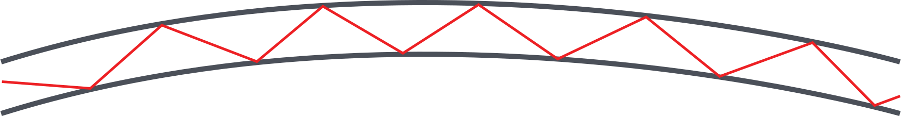
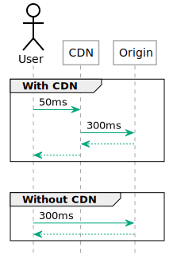

<a href="fh-cloud-computing-lecture-3-xaas.pptx"><button>Download PPTX 💻</button></a>
<a href="fh-cloud-computing-lecture-3-xaas.mp3"><button>Download MP3 🎧</button></a>
<a href="fh-cloud-computing-lecture-3-xaas.m4b"><button>Download M4B 🎧</button></a>
<a href="#"><button>Watch Video 🎬</button></a>

<h1>Beyond IaaS</h1>

This lecture walks you through the most important services offered by cloud providers beyond the IaaS layers. Sometimes this is called "PaaS" (Platform as a Service) indicating that it is intended as a developer platform.

The easiest way to remember the difference is that IaaS offers virtual machines and connected services. In order to operate on top of an IaaS platform you need someone skilled in running an operating system. In other words, you need a system administrator.

PaaS on the other hand is intended for developers. The platform services, on the other hand, are intended for developers. The main goal of PaaS services is enabling developers to deploy applications without having to manage the operating system of the underlying virtual machine.

There is, however, nothing preventing you from mixing IaaS and PaaS services. A typical use case would be using a managed database with virtual machines. This helps smaller teams because operating a database proficiently on a small scale can be an undue burden.

This might not seem like a big deal but consider that databases store data. Every time when data storage is concerned disaster recovery becomes more complex. If an IaaS team were to operate a database themselves they would need to regularly test backups and disaster recovery procedures. Managed databases take that complexity away.

Similarly, building a redundant database system that can perform an automatic failover requires a high skill level in managing that specific database engine. This skill level may not be available in small teams, or a small team may not want to spend time on managing the database instead of focusing on their core objective.

## Application load balancers

Application load balancers provide load balancing capabilities on [layer 7 of the OSI-model](https://en.wikipedia.org/wiki/OSI_model). In practice application load balancers on offer support [HTTP](https://en.wikipedia.org/wiki/Hypertext_Transfer_Protocol) and HTTPS load balancing.

HTTP is a request-response protocol. Typically connections are short-lived but longer connections (e.g. with [Websockets](https://en.wikipedia.org/wiki/WebSocket)) are also possible. Good application load balancers allow sending traffic to a different set of backends based on the host name (`example.com`) as well as the path (`/some/address`).

Some applications also require that subsequent requests from the same client end up on the same backend. This is called session stickiness and can be achieved in a variety of ways. Less advanced solutions route requests based on the source IP, while more advanced versions send a so-called [cookie](https://en.wikipedia.org/wiki/HTTP_cookie) to the client and route subsequent requests based on that cookie.

Sticky sessions, however, present a problem: when a backend goes down the users of that backend will be redistributed to other backends. In practice this usually means that users will be logged out. When a cascading fault, or a rolling update occurs that takes down multiple backends in rapid succession users can be subjected to multiple involuntary logouts.

This has an adverse effect on user experience which is why newer, so-called &ldquo;cloud native&rdquo; applications don't use sticky sessions. Instead, cloud native applications put client-specific data (e.g. [session data](https://en.wikipedia.org/wiki/Session_(computer_science)#HTTP_session_token)) in database systems with redundancy. Sessions themselves [have their own race condition problems](https://pasztor.at/blog/stop-using-php-sessions/), but that is not a discussion for this lecture.

## CDNs

While it seems the Internet is blazing fast nowadays delivering content to the other side of the planet is still an issue. As you may know most of the Internet is comprised of [fiber optic cabling](https://en.wikipedia.org/wiki/Optical_fiber). Data is transmitted by turning a laser on and off in rapid succession.

Let's do a little mental exercise: the speed of light is 299.792.458 m/s. The radius of our planet is 6.371 km. A ray of light should be able to round the planet in `6.371.000 / 299.792.458 = 0.021` seconds. In other words any data transmitted should be able to travel around the world in ~21 milliseconds. Yet, in practice we see latencies upwards of 100 ms when transmitting data from Europe to India.

The issue is that light does not go &ldquo;around the corner&rdquo;. Fiber optic cables work by having reflective walls so the light bounces off the walls repeatedly to reach the end. This multiplies the way light has to travel to reach the other side of the planet. This is further compounded by the fact that light can only travel so far in a fiber optic cable, repeaters and routers in between also need time to process the data.

The problem is further compounded by how HTTP works. When a website is loaded there are several elements that have to wait for each other. The website may reference a style sheet (CSS file), the CSS file may reference an image and so on. This means several round trips have to be done to build a page. [HTTP/2 server push](https://www.smashingmagazine.com/2017/04/guide-http2-server-push/) attempts to mitigate this.

CDN's work around this problem by replicating content to servers closer to the users. When a user requests a certain file that request lands on the CDN's *edge node* first. If the CDN has the file in the cache the delivery is very fast. If, however, the CDN does not have the content in cache the delivery will take longer.

In essence, CDN's help with latency issues *if the content can be cached*. in other words, this helps mostly with static content, but in combination with functions as a service (see below) dynamic content can also be delivered from edge nodes to some extent.

!!! tip Did you know?
    Low latency connections are important not just for delivering content. Stock exchanges benefit from very low latencies. For example, there is a [private microwave network between Frankfurt and London](https://arstechnica.com/information-technology/2016/11/private-microwave-networks-financial-hft/) that has twice the speed of the public internet.

!!! tip Did you know?
    SpaceX is building the [Starlink network](https://techcrunch.com/2020/06/15/spacex-will-have-to-starlink-internets-low-latency-within-the-next-month-to-qualify-for-up-to-16b-in-federal-funding/) to provide lower latency connectivity across the globe.

## Object Storage

### Cold storage

## Databases as a Service (DBaaS)

### Relational databases (SQL)

### Document databases

### Time Series databases

## Functions as a Service (FaaS / Lambda)

## Containers as a Service (CaaS)

## Stream processing

## Deployment pipelines
