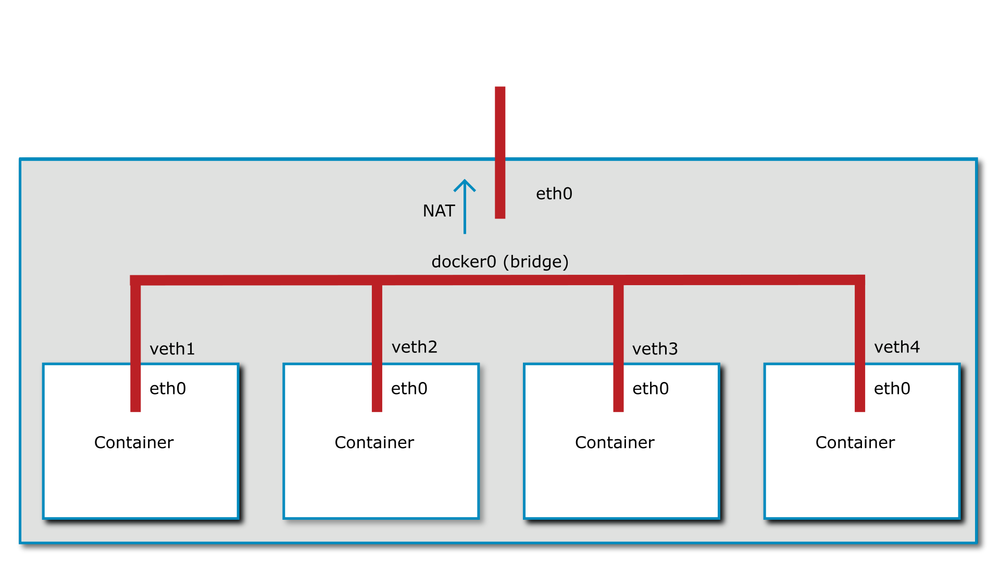
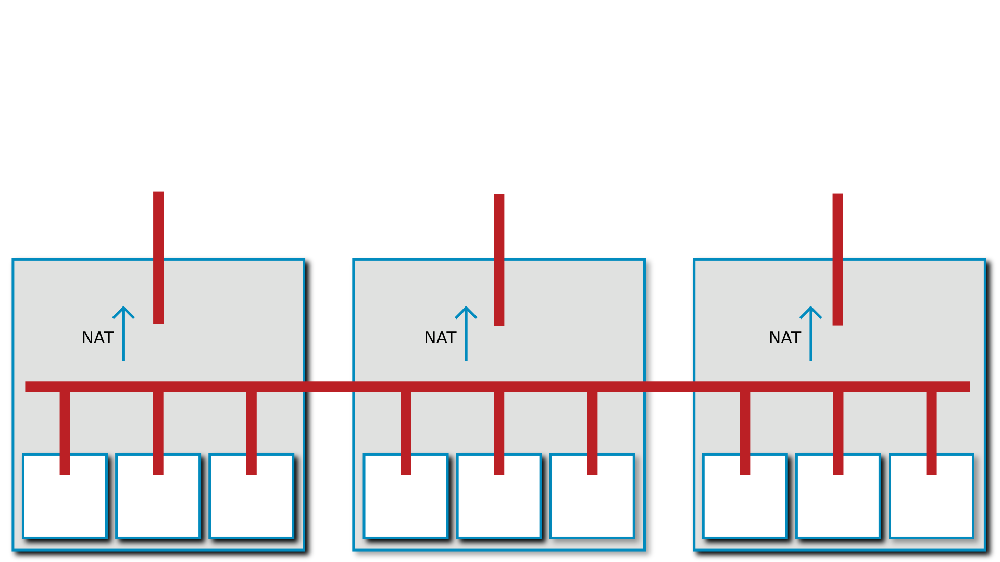

<div class="download">
<a href="fh-cloud-computing-lecture-4-containers.pptx"><button>Download PPTX 💻</button></a>
<a href="fh-cloud-computing-lecture-4-containers.mp3"><button>Download MP3 🎧</button></a>
<a href="fh-cloud-computing-lecture-4-containers.m4b"><button>Download M4B 🎧</button></a>
<a href="#"><button>Watch Video 🎬</button></a>
</div>

<h1>Containers & Container Orchestrators</h1>

In the [second lecture](../2-iaas/index.md) we have talked about how applications interact with the kernel and the hardware. By now you know that applications running in ring 3 do not have direct access to things like the disk. To access those details they need to execute a [system call](https://en.wikipedia.org/wiki/System_call) to the kernel. The kernel will then give the application the details required, for example a file from the disk.

Let's play a hypothetical game: process A wants to access a file called `test.txt`. It calls the kernel, the file is opened, and process A is now free to read the contents. When process B comes along and does the same, it will receive the same file.

Or does it? In the Linux kernel the filesystem root directory (starting with `/`) is a virtual construct that can be changed on a per-process basis. It is possible to make process A see a completely different folder structure then process B. This mechanism is called [chroot](https://en.wikipedia.org/wiki/Chroot). It is, in fact, so old that it predates Linux by more than a decade and was first present in Version 7 Unix in 1979.

!!! tip "Try it out yourself!"
    Run the following command on a 64 bit x86 Linux in an empty folder:
    
    ```
    mkdir -p ./bin &&\
    curl "https://www.busybox.net/downloads/binaries/1.21.1/busybox-x86_64" -o ./bin/busybox && \
    chmod +x ./bin/busybox && \
    ./bin/busybox --install ./bin && \
    sudo chroot . /bin/sh
    ```

    You should now be able to run `ls -la` or similar commands and see that you are in an almost empty filesystem with no ability to access the files outside. 

This alone only isolates the two process on a filesystem level, there are still plenty of opportunities for two processes to interact, for example:

- On the network
- [Interprocess Communication (IPC)](https://en.wikipedia.org/wiki/Inter-process_communication)
- [Sending signals to each other by process ID](https://en.wikipedia.org/wiki/Signal_(IPC))
- etc.

In the early 2000's there were two projects that attempted to implement process isolation in the Linux kernel: [OpenVZ](https://en.wikipedia.org/wiki/OpenVZ) and [Linux-VServer](https://en.wikipedia.org/wiki/Linux-VServer). Running these projects required patching and recompiling the Linux kernel from source.

Starting around 2006 several companies, including Google, IBM, SGI, Bull, and the OpenVZ project itself has put significant effort into taking OpenVZ apart and piece by piece and submitting it to the Linux kernel. The [User Beancounters](https://wiki.openvz.org/UBC) from OpenVZ, for example, became [cgroups](https://en.wikipedia.org/wiki/Cgroups) and allow resource allocation to a group of processes.

!!! tip "Do you want to know more about history?"
    The history of containerization is surprisingly hard to piece together despite the relative young age of the technology. If you want a bit of a deeper dive take a look at [&ldquo;A Brief History of Containers (by Jeff Victor & Kir Kolyshkin)&rdquo;](https://www.youtube.com/watch?v=doUktZIcXF0).

All these isolation technologies, together, form what's today known as Linux containers. Windows has undergone a similar development in recent years, and has *virtualized* the typical Windows interaction points between processe: job objects, process table, registry, filesystem, etc.

In essence, *containers don't exist*. They are a collection of technologies that provide process-level isolation for an application. These isolation techniques can, among others, include:

- A separate, virtual network card
- Process separation (no ability to send signals to other containers)
- A separate view of the filesystem
- Restricted IPC between containers
- User separation / user ID mapping

!!! tip "Do you want to build your own container engine?"
    You can! Take a look at [Liz Rice's Containers From Scratch](https://www.youtube.com/watch?v=Utf-A4rODH8) talk!
    
## Container images

[Docker](https://www.docker.com/) was not the first technology to create containers using the modern Linux API's, but it was the one that made containers popular. The edge Docker had over its competitors was the way it dealt with images. Other container solutions at the time, like LXC, tried to emulate virtual machines where a full operating system would be installed, and then updated. Docker chose a different route. A `Dockerfile` would contain the instructions needed to build a container image containing the application that should be containerized. These instructions would be executed and resulted in a container image. This container image could then be used to launch one or more copies of it.

Since the container image contains everything the application needs to run these images are ideal operating system independent packages. This solves the age-old problem of having to install the correct version of the runtime environment (PHP, Python, Java, etc) as it is contained within the container image.

When a container is run this container image is the basis for all the data that is contained within. The data is, however, not copied. If the application modifies or creates files only the difference is stored. This makes containers very lightweight on the storage front as well.

Docker went one step further, they introduced a way to share images between machines using a *registry*, a server that stores container images. The public [Docker hub](https://hub.docker.com/) contains a vast array of images built by the community. These technologies were later all standardized under the [Open Container Initiative](https://opencontainers.org/), creating a company-independent format for containers and technologies around them.

!!! warning
    Third party container images should be treated with the same due diligence like installing third party software on your computer! They can contain malicious code and can cause harm despite the containerization.

{{ quiz("Which is not running in a container?", [
    answer("A CPU"),
    answer("A userspace"),
    answer("A kernel"),
]) }}

{{ quiz("What is in a Dockerfile", [
    answer("A container image"),
    answer("A container snapshot"),
    answer("An instruction set how to make a container image"),
]) }}

## The container lifecycle

You can, of course, update a running container just as you would a traditional virtual machine. However, that is not the intended, or indeed, optimal way to use them. The intention of containers is *immutable infrastructure*. Immutable infrastructure means that containers are *never updated*. Instead, they are replaced. When a new version of a software needs to be installed the old container is shut down and a new one is launched from a new image.

Immutable infrastructure presents a massive benefit: instead of having to deal with a downtime when the upgrade is ran, the updated version can be tested before it is launched.

However, this concept reaches its limits when it comes to running software that needs to store data in a persistent fashion, for example, databases. For this purpose containers can designate special folders to be mounted as *volumes*. Volumes can be persisted by either mounting them as a folder from the host machine, or by mounting a network-based storage system.

## Orchestration (Swarm, Kubernetes, etc)

Docker and other container runtimes do not manage containers across multiple servers by themselves. Docker has received an addon called Docker Swarm, but nowadays the clear winner of the &ldquo;Container Wars&rdquo; is [Kubernetes](https://kubernetes.io).

Container orchestrators are responsible for determining which server has free capacity and schedule containers to run on them. When a server fails these orchestrators are responsible for discovering it and re-launching them on a different server.

Furthermore, container orchestrators contain a certain amount of integration with the cloud providers. Docker Swarm has very basic integrations, but Kubernetes on the other hand, has integrations with just about anything.

Depending on the cloud provider Kubernetes can automatically move block storage mounts to a different server when a container is moved, configure cloud load balancers and much more.

This flexibility comes at a cost: Kubernetes is very complex. A detailed explanation on how to deploy an application on Kubernetes would vastly exceed the bounds of this course. If you are interested in this topic we recommend taking a look at one of the many [Certified Kubernetes Application Developer](https://www.cncf.io/certification/ckad/) courses on the Internet.

## Container networking

As mentioned previously, containers regularly have their own, virtual network interfaces. This virtual network interface can be connected in a number of ways.

If we take a look at Docker's default networking model the virtual network interface is connected to an internal [network bridge](https://en.wikipedia.org/wiki/Bridging_(networking)). This enables containers to connect to each other. For connections to the Internet a [NAT](https://en.wikipedia.org/wiki/Network_address_translation) is performed.



More advanced options for container networking create a single virtual network across several hosts and connect the containers to this virtual network. This is an option with [Docker Swarm](https://docs.docker.com/engine/swarm/) and is always the case with [Kubernetes](https://kubernetes.io/).



When you look at these graphics, one question may come to mind: the cloud is quite dynamic in its nature, so how does a Kubernetes cluster receive incoming connections? After all, each of the nodes may be replaced with a new one, with a new IP address at any time? This is where the immense feature set of Kubernetes begins to show itself. Kubernetes includes several *controllers* that can interact with cloud providers in a variety of ways. One of these integrations can be, for example, the load balancer integrations. The Kubernetes network can be extended to a load balancer and that load balancer can send traffic directly over the virtual network used by the containers.

Further helping the dynamic nature of the cloud are features like the ability to create internal firewalls. These firewalls can help mitigate possible security vulnerabilities like [SSRF](https://pasztor.at/blog/what-is-ssrf). Since these firewalls can be created using the same API as the software deployment, the firewall rules for an application can be versioned in Git, for example.

Since everything required to run an application can be stored in a Dockerfile and a Kubernetes manifest the application source code can be self-contained. This is, of course, only true if the application is written in such a way that workes well with the cloud. This is described [in the next lecture](../5-cloud-native/index.md). 

## Kubernetes

We have talked about Kubernetes before, but we are dedicating this section to more detail as it has become quite apparent that Kubernetes is going to be the de-facto standard for container orchestration in the future.

The history of Kubernetes lies in the [Borg orchestrator from Google](https://en.wikipedia.org/wiki/Borg_(cluster_manager)). The intention is to be able to orchestrate workloads across thousands of machines. Since Kubernetes is highly scalable its design is difficult to use at small scale.

### Developer aspect

Developers of Kubernetes are only confronted with a subset of Kubernetes' complexity. A developer can create a Kubernetes manifest file (in YAML format) that instructs Kubernetes to run a certain set of containers, network them together, provide load balancers, etc.

The basic unit of scheduling is a **Pod**. A pod is a unit consisting of one or more containers that share a network namespace and can potentially also share other resources. Pods can either run continuously or can be scheduled to run to completion for one-off jobs or cronjobs.
 
However, unlike a simple Docker installation Kubernetes offers a way to manage Pods on a higher level. **Deployments** offer a way to create resource to manage downtimeless deployments and roll back to a previous version with a simple rollback command if desired. They do this by using **ReplicaSets**, an automatic resource creating multiple copies of a Pod.

As you can already see this highlights what we will discuss in the [next lecture](../5-cloud-native/index.md): a cloud-native application has to be ready to have multiple parallel copies of itself running.

For more difficult workloads Kubernetes also includes a **StatefulSet**. StatefulSets give a developer the ability to guarantee a predictable startup sequence of multiple Pods as well as a unique ID for each. This is especially important for replicated databases.

**DaemonSets** are, on the other hand, a special workload type more geared towards Kubernetes administrators, offering the ability to run a workload on every node of the cluster. This is often used to run utility Pods such as log collectors, monitoring agents, etc.

Since some Pods need to store data Kubernetes offers a flexible way to allocate storage in the cloud with the use of **PersistentVolumeClaims** (PVC) and **PersistentVolumes** (PV). A Kubernetes administrator would set up a PV which a developer then uses using a PVC. This decouples the developers and administrators work nicely.

It is worth remembering though that a single PV can only be used by a single PVC. This makes allocation in a larger cluster cumbersome. Naturally, Kubernetes has a solution for this problem called **provisioners**. These provisioners can dynamically create PVs as needed, usually by creating a network block storage volume in the cloud.

It is also worth noting that local storage provides no resilience against host machine failure, as we discussed in [lecture 2](../2-iaas/index.md). While using local storage with Kubernetes is possible and Kubernetes won't reschedule a workload with an attached local storage, it also limits the ability for Kubernetes to react to a node failure and move workloads.

In order to facilitate internal and external load balancing Kubernetes introduces the concept of **Services** to create *network load balancers* for each service. These services use the Pod labels to track which Pods they should send traffic to. A special type of service is the **Loadbalancer** which, given a cloud integration, dynamically creates an external IP address for a specific service.

Alternatively, workloads can also make use of the **Ingress** resource that dynamically configures the ingress controller to send HTTP workloads to specific pods. The ingress controller acts as an *application load balancer* for Kubernetes.

To augment these capabilities the **Job** resource gives developers the ability to use Kubernetes as a queue system and run one-off workloads. To run regular jobs the **CronJob** resource can be used.

{{ quiz("Which Kubernetes resource do you use to run a container on every node in a cluster?", [
    answer("Pod"),
    answer("Deployment"),
    answer("ReplicaSet"),
    answer("DaemonSet"),
    answer("Job"),
    answer("CronJob"),
]) }}

{{ quiz("Which of the following resources are managed by a Deployment in Kubernetes?", [
    answer("Pod"),
    answer("ReplicaSet"),
    answer("DaemonSet"),
    answer("Job"),
    answer("CronJob"),
]) }}

{{ quiz("Which of the following is the smallest unit in Kubernetes?", [
    answer("Pod"),
    answer("Deployment"),
    answer("ReplicaSet"),
    answer("DaemonSet"),
    answer("Job"),
    answer("CronJob"),
]) }}

### Architecture

The Kubernetes architecture is highly modular and the description given here is fairly generic. Individual Kubernetes distributions may differ greatly in their use of tools.


At the core of Kubernetes is the **API server**. This central piece is the endpoint for both the clients (for example the Kubernetes CLI called `kubectl`), other orchestrator components such as the controller-manager, cloud controller, or scheduler, and also the workload coordinator called the `kubelet.

The **scheduler** is responsible for deciding which container is supposed to run on which worker node. As the name says, it *schedules* the workload.

The **controller-manager** is a component if many small parts that decides what to run. For example, the ReplicaSet controller is responsible for creating multiple copies of the same pod.

The **cloud controller** is responsible for the cloud provider integration. This is optional for a static cluster, but required if autoscaling, or a load balancer integration is required.

The **kubelet** runs on every node and is presponsible for talking to the Container Runtime (e.g. containerd) to run the containers the scheduler deems necessary. It is worth mentioning that the Kubelet must be able to reach the API server on a network level, and vice versa. HTTP request flow in both directions in order to make a Kubernetes cluster work.

The **kube-proxy** service also often runs on each Kubernetes node to provide load balancing services, but there are replacements for this component.

The **Container Network Interface** (CNI) is a network plugin deployed alongside the kubelet and provides the previously-described overlay network. There is a wide range of CNI plugins from bare metal routing to [Calico](https://www.projectcalico.org/).

As a final piece of the puzzle **Container Storage Interfaces** (CSI) provide a way to integrate just about any storage provider as a driver for PVs.

{{ quiz("Which Kubernetes component talks to the container runtime?", [
    answer("Controller-Manager"),
    answer("Cloud Controller"),
    answer("API server"),
    answer("Scheduler"),
    answer("Kubelet"),
    answer("kubectl"),
    answer("kube-proxy"),
]) }}

{{ quiz("Which Kubernetes component is responsible for managing internal load balancers?", [
    answer("Controller-Manager"),
    answer("Cloud Controller")
    answer("API server"),
    answer("Scheduler"),
    answer("Kubelet"),
    answer("kubectl"),
    answer("kube-proxy"),
]) }}
