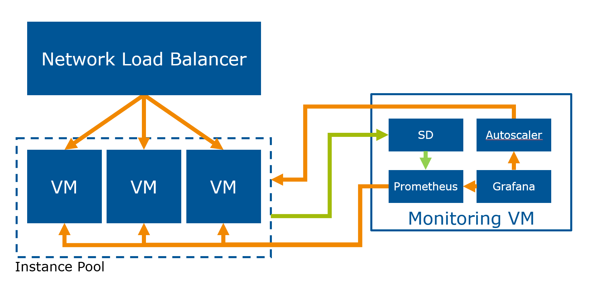

You are the cloud architect for a small work-for-hire company. A client wants to hire you but they are sceptical about your abilities to build an *autoscaling* service. They propose a proof of concept: build a service that runs a web application that is *deliberately slow* and load test it. Your cloud management should automatically launch new cloud servers when the load is high and remove servers when demand is low.

!!! warning
    Do not continuously run your setup on Exoscale or you will run out of budget! Budget limitations are part of building cloud system so you have to learn to deal with it.

After taking a look at the capabilities of the cloud provider and discussing the constraints with your colleagues you decide that the following approach would be best:

- You are going to use [Terraform](https://terraform.io) to automate the setup and tear down of the cloud infrastructure. This is necessary because if you continuously use the cloud service you will not fit in the budget.
- You will use [instance pools](https://community.exoscale.com/documentation/compute/instance-pools/) to manage the variable number of cloud servers and [Network Load Balancers](https://www.exoscale.com/syslog/network-load-balancer-release/) to balance the traffic between them.
- You will set up a dedicated monitoring and management instance which will run [Prometheus](https://prometheus.io/) to automatically monitor a varying number of servers. You will write a
  [custom service discovery](https://prometheus.io/blog/2015/06/01/advanced-service-discovery/#custom-service-discovery) agent that creates a file with the IP addresses of the machines in the instance pool for Prometheus to consume.
- On the instance pool you will deploy the [Prometheus node exporter](https://github.com/prometheus/node_exporter) to monitor CPU usage.
- You will install [Grafana](https://grafana.com/) to provide a monitoring dashboard and the ability to send webhooks.
- You will configure an alert webhook in Grafana that sends a webhook to an application written by you. If the average CPU usage is above 80%, or below 20% to scale up or down respectively a webhook is sent.
- You will write an application that receives this webhook and every 60 seconds scales the instance pool up or down if a webhook has been received.

As you also have to demonstrate to the client that you can work in an agile methodology you agree in 4 week sprints with a demo at the end of each sprint as outlined in the [deadlines](/deadlines) document.
 
As a dummy service to generate load you will use [http-load-generator](https://github.com/FH-Cloud-Computing/http-load-generator).

The manual way to implement this architecture is described [on the Exoscale blog](https://www.exoscale.com/syslog/autoscaling-with-grafana-and-prometheus/). We recommend reading and doing the steps described in the blog post at least once.

Optionally, you can make use of the following (**incurs a 5% point-penalty each**):

- [prometheus-sd-exoscale-instance-pools](https://github.com/FH-Cloud-Computing/prometheus-sd-exoscale-instance-pools) to feed instance pool data into Prometheus
- [exoscale-grafana-autoscaler](https://github.com/FH-Cloud-Computing/exoscale-grafana-autoscaler) to drive the autoscaling behavior.

## Handing in your project work

In order to hand in your project work you must upload your code to a Git repository, for example on GitHub. Submit the link of the Git repository [in Moodle](https://moodle.fh-campuswien.ac.at/course/view.php?id=14657).

Your Terraform code **must** be able to install the complete infrastructure into an empty Exoscale account. It **must** ask for the Exoscale API key and secret using the `exoscale_key` and `exoscale_secret` variable.

If you opt to only implement the manual method (without Terraform) please enter `manual` in instead of the text field and we will contact you for a manual review appointment.

!!! warning
    Keep in mind that only submitting a manual solution will give you minimal points. We strongly recommend you ask for help if you are stuck rather than implementing the manual solution.

!!! note
    The automated version has to run without manual intervention beyond inserting variables. Additionally, the solutions will be spot-checked for duplication, and you may be required to jump on a 10 minute call to quickly explain your call.
    
!!! note
    If your code does not run after handing it in and that error is due to a **minor** mistake in your Terraform code you will be given a chance to fix it within 5 days.

## Getting help

Please see the [getting help page](../help/).